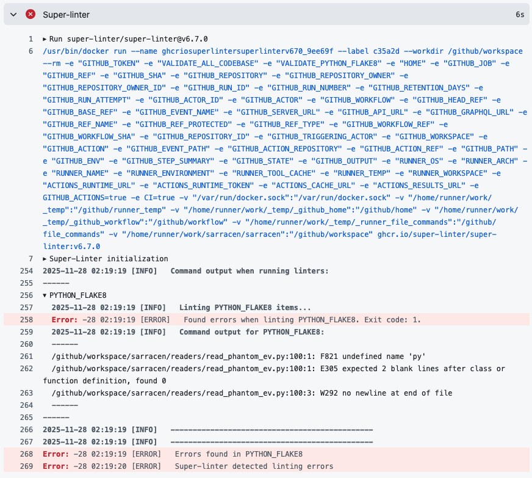

.. _contributing:

============
Contributing
============

Contributions are welcomed and appreciated. Here are some ways to get involved:

- Submitting bug reports.
- Feature requests or suggestions.
- Improving the documentation or providing examples.
- Writing code to add optimizations or new features.

Please use the `GitHub issue tracker
<https://github.com/ttricco/sarracen/issues>`_ to raise any bugs or to submit
feature requests. If something does not work as you might expect, please let us
know. If there are features that you feel are missing, please let us know.

Code submissions should be submitted as a pull request. Make sure that all
existing unit tests successfully pass, and please add any new unit tests that
are relevant. Documentation changes should also be submitted as a pull request.

If you are stuck or need help, `raising an issue
<https://github.com/ttricco/sarracen/issues>`_ is a good place to start. This
helps us keep common issues in public view. Feel free to also `email
<mailto:tstricco@mun.ca>`_ with questions.

Please note that we adhere to a `code of conduct
<https://github.com/ttricco/sarracen/blob/main/CODE_OF_CONDUCT.md>`_.

Developer Guidelines
--------------------

There are several guiding principles to the development of Sarracen that we
follow.

1. **Simple, intuitive API.**

    A low barrier of entry for new users is important to us. This is why we
    model off of common scientific libraries, as we expect our users to be
    familiar with these tools. The naming of functions and their arguments
    should be clear, follow standard patterns, and avoid unnecessary
    complexity.

2. **Efficiency.**

    Performance is important. A simple guiding principle is to leverage
    built-in pandas or NumPy functions when possible.

3. **Pure Python.**

    Sarracen is developed entirely in Python, without mixing in other code
    extensions such as Cython. Code efficiency is important, but we prioritize
    the maintainability and portability afforded by a pure Python codebase.

4. **Unit tested.**

    We use pytest to comprehensively test Sarracen. Any new code added should
    come with an associated set of unit tests. System testing is important, but
    unit tests ensure the long-term correctness and reliability of Sarracen.

5. **Avoid code lint.**

    We use flake8 to conform to Python style guides. Avoiding lint might not
    help write good code, but it can help avoid writing bad code. Our aim is to
    reduce technical debt to help ensure consistency and readability across the
    codebase.

Pull Requests
-------------

If you have a new code addition or a change to existing code that you would
like to submit, start by making a pull request (PR) on GitHub.

All changes to Sarracen's code base are made through Pull Requests. Start by
forking Sarracen on GitHub. Add your changes to your repository on your GitHub
account (optionally on a development branch on your account). Then use GitHub
to open a new Pull Request. Add details about your change, and resolve any
issues found by the automated GitHub actions.

Code Lint
--------------

Sarracen uses ``flake8`` to follow Python style guides on naming conventions,
code structure, and formatting. This is sometimes annoying, but adopting a
single style is beneficial.

Sarracen also uses type hints across the code base. Python
is not a typed language, but type hints help to avoid bugs and make intent
clear.

You can run flake8 on your local codebase as follows:

.. code-block::

    pip install flake8
    flake8 sarracen

You can also run flake8 on specific directories or files, rather than the whole
codebase. A list of specific errors per file with line numbers will be returned.

GitHub actions will automatically run flake8 on pull requests.

If the automated linter finds lint errors in your code, then go to the
``Checks`` tab on the PR. Expand the section "Super-linter" marked by the red
X, and then expand the PYTHON_FLAKE8 section. This will give you the output
from flake8, such as the specific lines of code and their associated lint
errors.

In the example below, the specific flake8 errors are given on lines 261, 262,
and 263 of the output. These point out that there is an undefined variable,
no blank lines after class or function declaration, and that there was no
newline at the end of the file. Yes, we do care about having a newline at the
end of the file.

