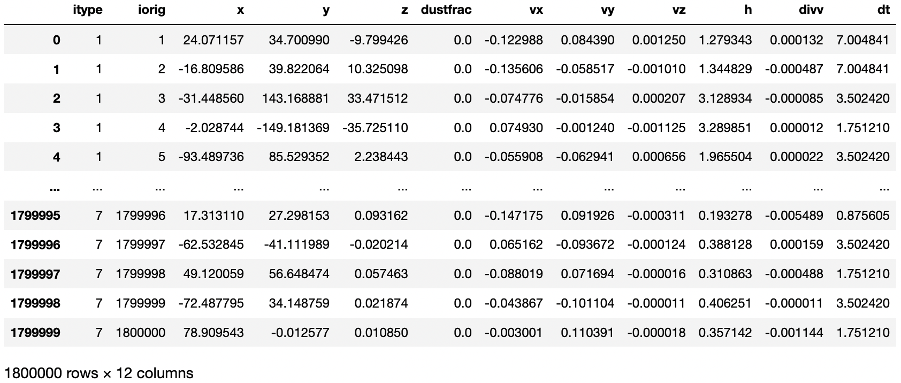
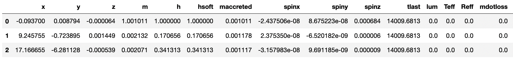
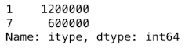
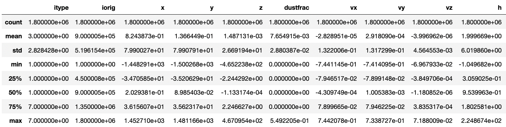
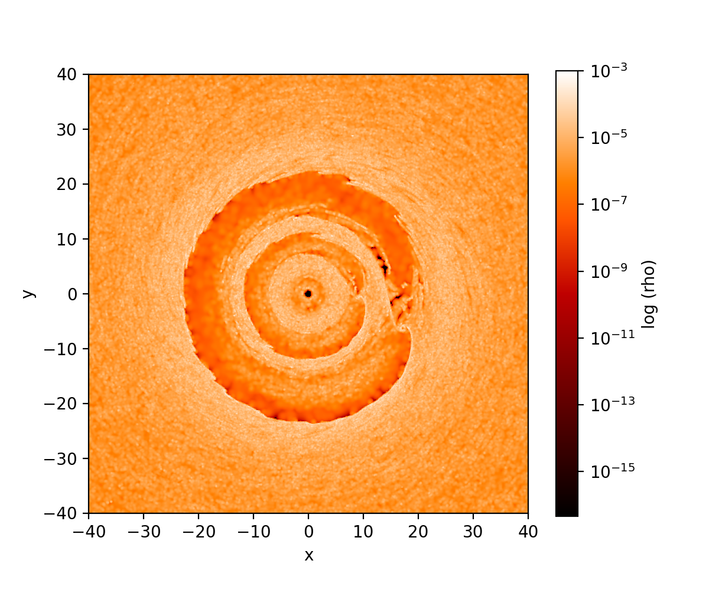
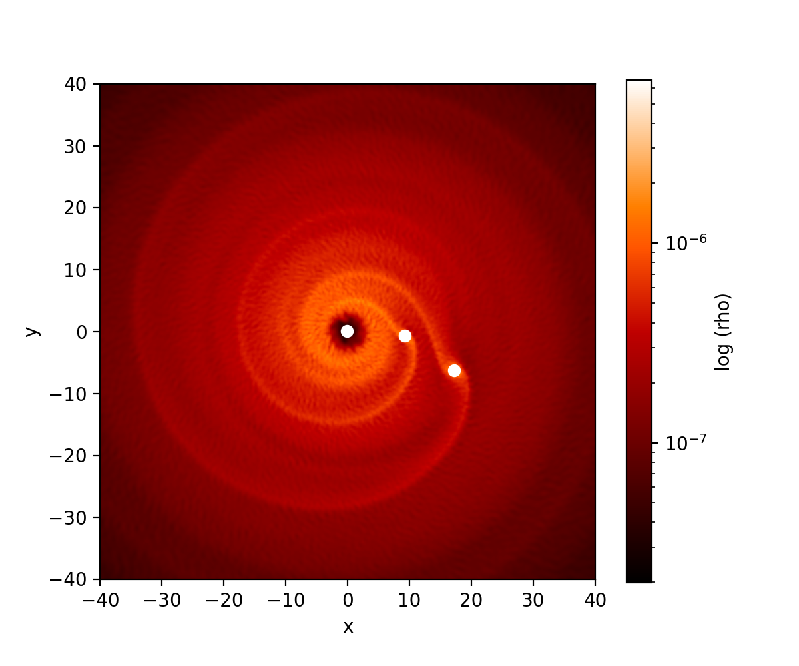

.. _dustydisc:

==========
Dusty Disc
==========

We study the simulation output of a dusty accretion disc with two embedded protoplanets.

The host star is 1 solar mass. It has two orbiting Jupiter mass planets at 10 and 20 AU. The accretion disc has both a gas and dust component, with a dust-to-gas ratio of 0.01.

The star and planets are modeled using sink particles. The gas and dust modeled using two species of particles. The analysis below is after 25 orbits of the outer planet.

In a Jupyter notebook, or other interactive Python environment,

>>> # A sample analysis of the Orszag-Tang vortex at t=0.5.
>>>
>>> import sarracen
>>>
>>> sdf, sdf_sinks = sarracen.read_phantom('dustydisc_00250')

By default, ``read_phantom()`` will split sink particles to their own SarracenDataFrame. This can be changed using the ``separate_types=`` parameter (see the :ref:`API <api>`).

>>> sdf

>>> sdf_sinks

In Phantom, gas particles are ``itype=1`` and dust particles ``itype=7``. There are 1.2M gas particles and 600k dust particles.

>>> sdf['itype'].value_counts()

>>> sdf.describe()

Sarracen supports pandas style slicing. For example, to get a SarracenDataFrame of just the gas particles, one could use ``sdf[sdf.itype==1]``.

Cross-sectional renderings of the gas and dust components of the disc are below.

>>> sdf[sdf.itype == 1].render('rho', xlim=(-40, 40), ylim=(-40, 40), log_scale=True, xsec=0.0)

>>> sdf[sdf.itype == 7].render('rho', xlim=(-40, 40), ylim=(-40, 40), log_scale=True, xsec=0.0)

Rendering sink particles can use Matplotlib's ``scatter()``, where sink particles are plotted as a scatterplot over the rendered image. Seaborn's ``scatterplot()`` is another good option.

Sarracen's render function returns a Matplotlib Axes object (and can accept one too).

>>> ax = sdf[sdf.itype == 1].render('rho', xlim=(-40, 40), ylim=(-40, 40), log_scale=True, xsec=0.0)
>>> ax.scatter(x=sdf_sinks['x'], y=sdf_sinks['y'], color='white')

