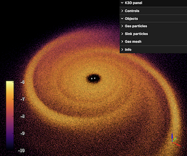
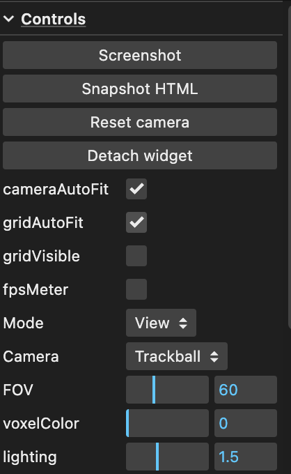
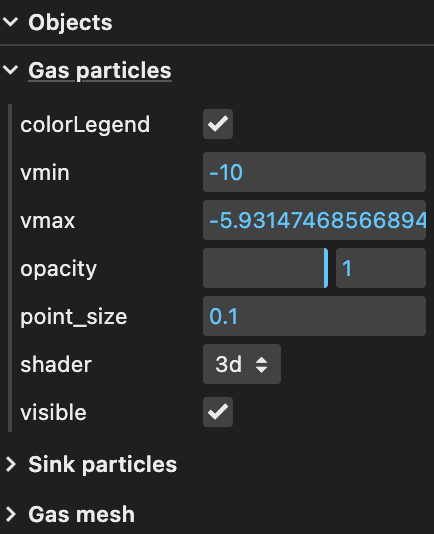

.. _k3d:

==========
K3D
==========

The following example code shows how to visualize a snapshot of a circumbinary disk simulation with Sarracen and K3D-Jupyter.

K3D is a Python package designed for interactive 3D visualization in Jupyter notebooks. It provides powerful tools for visualizing scientific data, simulations, and models in 3D space with ease. K3D supports plotting various 3D objects such as points, meshes, and surfaces. It offers customization options for colors, sizes, and styles, and provides interactive controls for exploring 3D visualizations within Jupyter notebooks, including zooming, panning, and rotation.

Installation
-------------------------------------------------------

K3D can be installed via pip and also through conda:

>>> pip install k3d
>>> conda install -c conda-forge k3d

To enable the extension within Jupyter Notebook :

>>> jupyter nbextension install --py --user k3d
>>> jupyter nbextension enable --py --user k3d

Note: Jupyter, Saracen and K3D must be installed in the same way to work properly.

Reading a Phantom snapshot with Saracen and visualizing it with K3D
--------------------------------------------------------------------

Within the Jupyter Notebook, the following packages are needed

>>> import matplotlib.pyplot as plt
>>> import numpy as np
>>> import sarracen
>>> import k3d

To load the phantom snapshot and retrive the density for the gas component

>>> gas, sinks = sarracen.read_phantom('Md0p25_01500')
>>> 
>>> gas.calc_density()  

For this example, both SPH particles and the 3D density grid will be displayed. To extract the positions and densities of the SPH particles (sinks and gas)

>>> sinks_pos = np.dstack((sinks.x,sinks.y,sinks.z))
>>>
>>> gas_pos   = np.dstack((gas.x,gas.y,gas.z))

For a better visualization it is convenient to take the logarithm of the density.
 
>>> gas_dens = np.log10(gas.rho)

The 3D density grid can be created using the ``sph_interpolate()`` function in Sarracen. 
Here the number of pixels and limit in each dimension have been set. These values can be changed as desired.

>>> dens_interp = gas.sph_interpolate('rho',
>>>                                  x_pixels=200,
>>>                                  y_pixels=200,
>>>                                  z_pixels=200,
>>>                                  xlim=(-300,300),
>>>                                  ylim=(-300,300),
>>>                                  zlim=(-300,300),
>>>                                  )

Note: It is possible to take the logarithm of the density grid to have a better visualization, but special care must be taken with zero values to avoid problems. 

Next, the gas particles and sinks are defined as points objects in K3D. Particles will be colored by density, defined in the attribute parameter. In the case of sinks, no attribute is  assigned and they are directly colored white. Values are set for the object name, particle size (not related to the physical size), and shading. Consult the documentation to see all available parameters. 

>>> gas_particles = k3d.points(
>>>    gas_pos.astype(np.float32),
>>>    attribute=gas_dens,
>>>    name='Gas particles',
>>>    shader='3d',
>>>    point_size=0.1
>>>    )

>>> sink_particles = k3d.points(
>>>    sinks_pos.astype(np.float32),
>>>    name='Sink particles',
>>>    shader='3d',
>>>    color=0xffffff,
>>>    point_size=3,
>>>    )

The density grid is defined by the volume object in K3D. Bounds must correspond to the size of the box on which the density interpolation was made.

>>> volume = k3d.volume(
>>>    dens_interp.astype(np.float32),
>>>    name='Gas mesh',
>>>    bounds=[-300, 300, -300, 300, -300, 300]
>>>    )

To create the K3D plot

>>> plot = k3d.plot()

All previously created K3D objects are then added.

>>> plot += gas_particles
>>>
>>> plot += sink_particles
>>>
>>> plot += volume

Some parameters such as the background color or the grid visibility can be set, as shown below. Other parameters can be found in the documentation.

>>> plot.background_color = 0x000000
>>> plot.grid_visible = False

Finally we display the K3D plot.

>>> plot.display()

Other options can be modified in the control panel.

It is possible to export the K3D plot to a HTML file. This file can be opened in a web browser. The control panel remains functional once opened.

>>> with open('snapshot.html', 'w') as f:
>>>    f.write(plot.get_snapshot())

