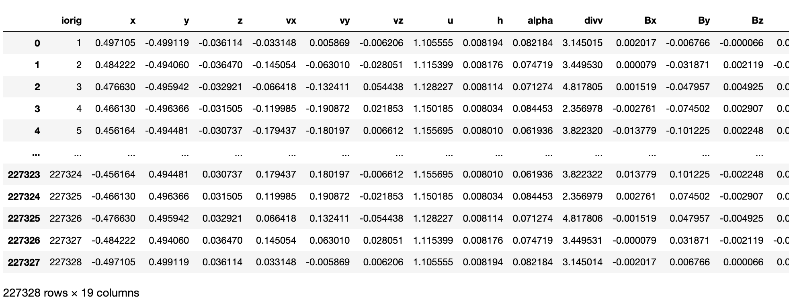
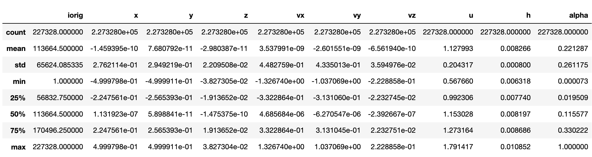
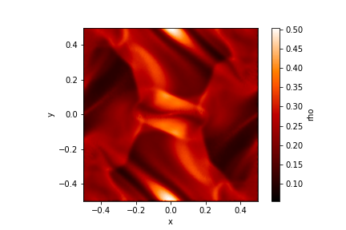
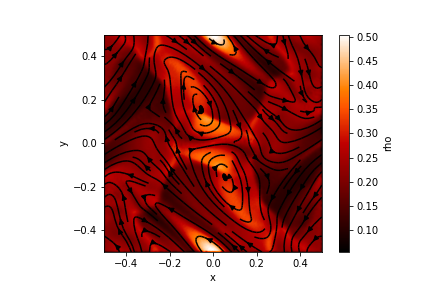
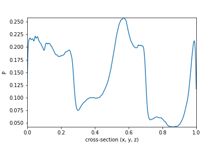

.. _ot:

==================
Orszag-Tang Vortex
==================

The Orszag-Tang vortex is a commonly used test case to validate magnetohydrodynamic codes.

This example is a sample analysis of the Orszag-Tang vortex at t=0.5. This is a 3D thin slab. See section 5.6.3 in the main Phantom paper for more details. Note that the boundaries in this example x,y=[-0.5, 0.5], in contrast to [0,1].

In a Jupyter notebook, or other interactive Python environment,

>>> # A sample analysis of the Orszag-Tang vortex at t=0.5.
>>>
>>> import sarracen
>>>
>>> sdf = sarracen.read_phantom('ot_00010')
>>> sdf

>>> sdf.describe()

>>> sdf.render('rho', xsec=0.0)

>>> sdf.render('rho', xsec=0.0)
>>> sdf.streamlines(('Bx', 'By', 'Bz'), xsec=0.0)

>>> # use convenience function to calculate density from smoothing lengths and masses
>>> sdf.calc_density()
>>> sdf['P'] = sdf['u'] * sdf['rho'] * (sdf.params['gamma'] - 1.0)
>>>
>>> sdf.lineplot('P', xlim=(-0.5, 0.5), ylim=-0.1875, zlim=0.0)

