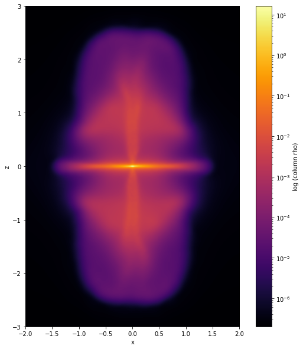

# Summary

Smoothed Particle Hydrodynamics is a method of fluid simulation,
commonly used for astrophysics problems [@monaghan:1992]. This method uses a collection of particles
in 2D or 3D space, and the interactions between neighboring particles are used to
determine the next state of the simulation. The result of these simulations is a set
of particles with real-valued coordinates. To represent SPH results in an image,
a special conversion must take place, where the "contributions" of each arbitrary particle
is discretized and summed onto a uniform grid. This process is known as SPH interpolation.

{width=50%}

# Statement of need

The current standard for visualization of SPH data is `Splash`, a command-line
tool built in Fortran [@price:2007]. It is very comprehensive, but has a few key issues.
First, Fortran can often be difficult to use, so modifications to `Splash` for cases of
unique analysis can be difficult. Secondly, the graphs produced by `Splash` cannot be
easily edited after creation, so image editing tools often must be used after image creation.

`sarracen` is a Python package for analysis and visualization of SPH data dumps from software
that produce SPH simulations, such as `Phantom` [@phantom]. By using Python, creating custom scripting
analysis subroutines becomes much easier. The plots generated by `sarracen` are built using
`matplotlib`, so the individual details of the produced plot can be edited quite easily. As
well, we can leverage the abundance of community-built libraries available for Python. For
example, statistical analysis can be easily performed on SPH datasets using libraries such
as `Scipy`. Sarracen can run in a Jupyter notebook environment, so analysis and visualization
results can be easily shared, presented, and modified.

# Features

`Sarracen` supports visualization of SPH particle data to 1D lines, and 2D/3D grids. Data across
all axes can be considered (column integration), or only a thin slice across the dataset (cross-section).
Vector quantities can be rendered with an arrow plot or a streamline plot. Because of tight integration
with `pandas` and `numpy`, users with experience of either of these libraries can easily manipulate
and analyze loaded SPH data.

SPH datasets can be quite large, so Sarracen interpolation code is parallelized using `numba` to
ensure a reasonable level of performance. As well, `Sarracen` can use a CUDA-enabled GPU for all
interpolation routines, allowing further performance gains.

sarracen also supports calculation of exact interpolations for SPH data, using analytically derived
integrals [@petkova:2018]. This calculation is currently supported for 2D interpolation (for 2D datasets),
and 3D column interpolation (for 3D datasets) using a cubic spline kernel.

# Acknowledgements

# References

